# Udacity Sensor Fusion Nanodegree - Project 2: 3D Object Tracking

This is the final project in 2nd course in the above mentioned nano degree with focus on object tracking using camera and lidar. The repository is a fork from [Udacity's repository for the project](https://github.com/udacity/SFND_3D_Object_Tracking) to be completed.

The tasks to carry out are: 
1. Develop a way to match 3D objects over time by using keypoint correspondences. 
2. Compute the TTC based on Lidar measurements. 
3. Do the same using the camera using detected and matched keypoints. 
4. Conduct tests and evaluations. Identify the most suitable detector/descriptor combination for TTC estimation and propose methods for making measurements robust. 

## Results and conclusion

The figure below shows the final results. FAST detector together with BRIEF descriptor appears to offer good combination. According to the previous project, the combination is also computationally efficient and fastest combination for tracking. The implementation of Time To Collision estimate follws the course material with taking the median value of distance ratios between the previous image and the current image for estimating the final value.

The point cloud was first "filtered" by a step of Euclidean Clustering that eliminated small clusters. After that, the closest point in the remaining cloud is used for estimating the Time To Collision.

<center>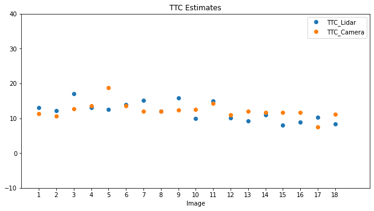</center>
<center>Final result obtained with orange) FAST detectorr, BRIEF descriptor, Brute Force matching and 

KNN with k = 2 selection and blue) Using point cloud with clustering out smaller clusters.
</center>

### Point cloud

The figure below shows the estimate based on the closest point without any filtering or averaging. As can be seen there sudden variations can be seen. 
<center>
  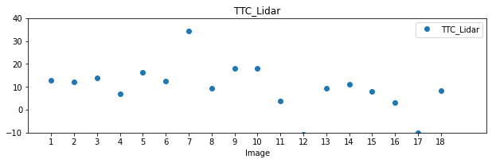
</center>

### Camera
All combinations of detectors and descriptors were tested together with Brute Force matching and KNN(k=2) selector. Certain combinations were not performing well, while several detectors were quite successful. FAST was producing generally good result and was selected due to its numerical effciency. Equally, BRIEF was performing well and is fast. 
#### Detectors
Below, results of different detectors together with BRIEF as descriptor are shown.
<center>
  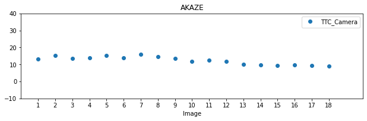 
  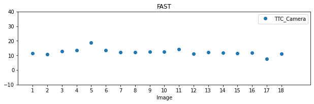 
  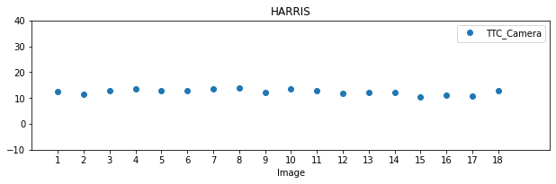 
  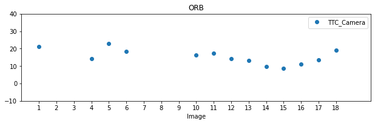 
  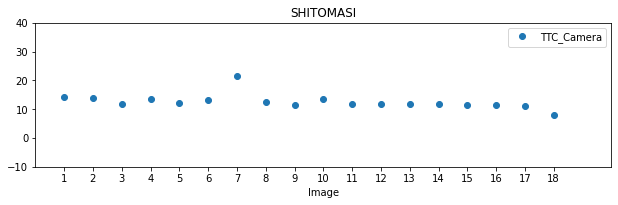 
  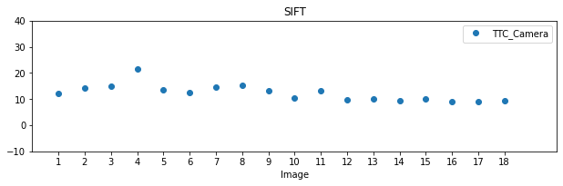 
</center>


#### Descriptors
Below, results of different descriptor together with FAST as detector are shown.
<center>
  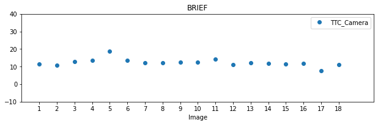 
  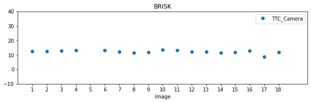 
  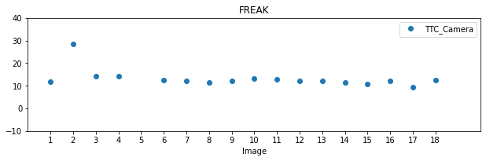 
  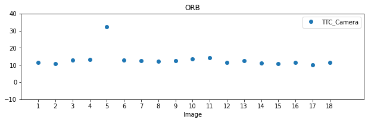 
  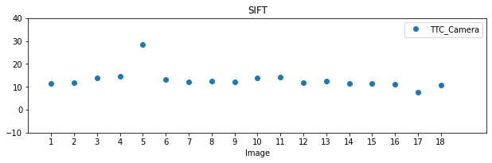 
</center>

## Theory and methods
<center>
  
</center>
The above picture is from the class material and the repositor. This figure shows the principal architecture of the tracking algorithm. The program prncipally goes through the following steps:

1. Acquire data - here, a color image and a point cloud are loaded from files. In a real case, the data will be streamed from the sensor.
2. The color image is sent to Yolo and objects on the image are detected, classified and cropped.
3. Lidar points are cropped with focus on the ego lane.
4. The lidar points are associated with the corresponding bounding box detected by Yolo. This is done by projecting each of points to the camera image and find the bounding box that contains it.
5. The gray version of the camera image is used for keypoint detection.
6. Descriptor for each keypoint is extracted.
7. Keypoint from current image are matched with those from the previous image.
8. Bounding boxes defined by Yolo are revisited. Each of boxes in the current image is matched with the bounding box in the previous image with most number of matched keypoints.
9. The list of all bounding box matches are looped and corresponding bounding boxes are picked from the current and previous images.
10. The pair of bounding boxes from the current and previous image, where both contain lidar points are considered for estimation of Time To Collision, by using the distance between key points and by using the lidar points separately.

## Rubrik points

### FP.1 Match 3D Objects - Implementing the method "matchBoundingBoxes"

```C++
void matchBoundingBoxes(std::vector<cv::DMatch> &matches, std::map<int, int> &bbBestMatches, DataFrame &prevFrame, DataFrame &currFrame)
{
    // Outer loop over all bounding boxes in the current image
    for (auto bboxCurr : currFrame.boundingBoxes)
    {  
        // For each bounding box, make a list of all the indices of bounding boxes in the previous image, with keypoints that are
        // matched with the current bounding box. The number of repeated index shows the number of matched keypoint for that 
        // specific bounding box.
        std::list<int> boxMatches;
        for (auto match : matches)
        {
            if (bboxCurr.roi.contains(currFrame.keypoints[match.trainIdx].pt))
            {
                for (auto bboxPrev : prevFrame.boundingBoxes)
                {
                    if (bboxPrev.roi.contains(prevFrame.keypoints[match.queryIdx].pt))
                    {
                        boxMatches.push_back(bboxPrev.boxID);
                    }
                }
            }
        }
        if (boxMatches.size() > 0)
        {
            // The best match is the one with maximum number of occurance in the list. To find that,
            // count number of occurance for each unique index value.
            auto uniqueIndices(boxMatches);
            uniqueIndices.sort();
            uniqueIndices.unique();
    
            int bestIndex = *uniqueIndices.begin();
            int maxOccurance = std::count(boxMatches.begin(), boxMatches.end(), bestIndex);
            int occurance = 0;
            if (uniqueIndices.size() > 1)
            {
                for (auto itr1 = uniqueIndices.begin(); itr1 != uniqueIndices.end(); itr1++)
                {
                    occurance = std::count(boxMatches.begin(), boxMatches.end(), *itr1);
                    if (occurance > maxOccurance)
                    {
                        maxOccurance = occurance;
                        bestIndex = *itr1;
                    }
                }

            }
            bbBestMatches.insert(std::make_pair(bestIndex, bboxCurr.boxID));
        }
    }
}
```

### FP.2 Compute Lidar-based TTC - Compute the time-to-collision in second for all matched 3D objects using only Lidar measurements

```C++
void computeTTCLidar(std::vector<LidarPoint> &lidarPointsPrev,
                     std::vector<LidarPoint> &lidarPointsCurr, double frameRate, double &TTC)
{
    double minXPrev = 1e9, minXCurr = 1e9;
    double dT = 1 / frameRate; // time between two measurements in seconds

    //// Use Euclidean Clustering for filtering out segments with fewwer number of points.
    EuclideanClustering<LidarPoint> ecPrev(lidarPointsPrev), ecCurr(lidarPointsCurr);
    float clusterTolerance = 0.2;
    int minSize = 50, maxSize = 1000;

    //// An unisotropic box is used to find points close to each other. The box is 5 times smaller in x-direction.
    auto prev_cluster_indices = ecPrev.euclideanCluster({clusterTolerance/5, clusterTolerance, clusterTolerance}, minSize, maxSize);
    auto curr_cluster_indices = ecCurr.euclideanCluster({clusterTolerance/5, clusterTolerance, clusterTolerance}, minSize, maxSize);

    // cout << "Segmentation. Prev: " << prev_cluster_indices.size() << " Curr: " << curr_cluster_indices.size() << endl;

    // find closest distance to Lidar points within ego lane
    // For each segment, the points are first sorted and then either smaller or median point can be selected.
    for (auto it1 = prev_cluster_indices.begin(); it1 != prev_cluster_indices.end(); it1++)
    {
        vector<LidarPoint> segPoints;
        for (auto it2 = it1->begin(); it2 != it1->end(); it2++)
        {
            segPoints.push_back(lidarPointsPrev[*it2]);
        }
        std::sort(segPoints.begin(), segPoints.end(), [](LidarPoint a, LidarPoint b) {return a.x < b.x;});
        long medIndex = floor(segPoints.size() / 2.0);
        double medDist = segPoints.size() % 2 == 0 ? (segPoints[medIndex - 1].x + segPoints[medIndex].x) / 2.0 : segPoints[medIndex].x; // compute median dist. ratio to remove outlier influence

        // Minimum distance point:
        minXPrev = minXPrev > segPoints[0].x ? segPoints[0].x : minXPrev;
        // Median distance point:
        // minXPrev = minXPrev > medDist ? medDist : minXPrev;
    }
    for (auto it1 = curr_cluster_indices.begin(); it1 != curr_cluster_indices.end(); it1++)
    {
        vector<LidarPoint> segPoints;
        for (auto it2 = it1->begin(); it2 != it1->end(); it2++)
        {
            segPoints.push_back(lidarPointsCurr[*it2]);
        }
        std::sort(segPoints.begin(), segPoints.end(), [](LidarPoint a, LidarPoint b) {return a.x < b.x;});
        long medIndex = floor(segPoints.size() / 2.0);
        double medDist = segPoints.size() % 2 == 0 ? (segPoints[medIndex - 1].x + segPoints[medIndex].x) / 2.0 : segPoints[medIndex].x; // compute median dist. ratio to remove outlier influence

        // Minimum distance point:
        minXCurr = minXCurr > segPoints[0].x ? segPoints[0].x : minXCurr;
        // Median distance point:
        // minXCurr = minXCurr > medDist ? medDist : minXCurr;
    }

    // compute TTC from both measurements
    if (abs(minXPrev - minXCurr) < 1e-3)
    {
        TTC = 1e3;
    }
    else
    {
        TTC = minXCurr * dT / (minXPrev - minXCurr);
    }
}
```

In this method, Euclidean Clustering has been used to find the main part of the front car. The definition can be found in [clustering.h](src/clustering.h). 

### FP.3 Associate Keypoint Correspondences with Bounding Boxes - Prepare the TTC computation based on camera measurements by associating keypoint correspondences to the bounding boxes and store all matches to a vector in the respective bounding box.

```C++
// associate a given bounding box with the keypoints it contains
void clusterKptMatchesWithROI(BoundingBox &boundingBox, std::vector<cv::KeyPoint> &kptsPrev, std::vector<cv::KeyPoint> &kptsCurr, std::vector<cv::DMatch> &kptMatches)
{
    for (auto match : kptMatches)
    {
        if (boundingBox.roi.contains(kptsCurr.at(match.trainIdx).pt))
        {
            boundingBox.kptMatches.push_back(match);
            boundingBox.keypoints.push_back(kptsCurr.at(match.trainIdx));
        }
    }
}

```

### FP.4 Compute Camera-based TTC - Compute the time-to-collision in second for all matched 3D objects using only keypoint correspondences from the matched bounding boxes between current and previous frame.

```C++
void computeTTCCamera(std::vector<cv::KeyPoint> &kptsPrev, std::vector<cv::KeyPoint> &kptsCurr, 
                      std::vector<cv::DMatch> kptMatches, double frameRate, double &TTC, cv::Mat *visImg)
{
    // ...
    // compute distance ratios between all matched keypoints
    // This implementation is taken from course material with the mean replaced with median
    vector<double> distRatios; // stores the distance ratios for all keypoints between curr. and prev. frame
    for (auto it1 = kptMatches.begin(); it1 != kptMatches.end() - 1; ++it1)
    { // outer kpt. loop

        // get current keypoint and its matched partner in the prev. frame
        cv::KeyPoint kpOuterCurr = kptsCurr.at(it1->trainIdx);
        cv::KeyPoint kpOuterPrev = kptsPrev.at(it1->queryIdx);

        for (auto it2 = kptMatches.begin() + 1; it2 != kptMatches.end(); ++it2)
        { // inner kpt.-loop

            double minDist = 100.0; // min. required distance

            // get next keypoint and its matched partner in the prev. frame
            cv::KeyPoint kpInnerCurr = kptsCurr.at(it2->trainIdx);
            cv::KeyPoint kpInnerPrev = kptsPrev.at(it2->queryIdx);

            // compute distances and distance ratios
            double distCurr = cv::norm(kpOuterCurr.pt - kpInnerCurr.pt);
            double distPrev = cv::norm(kpOuterPrev.pt - kpInnerPrev.pt);

            if (distPrev > std::numeric_limits<double>::epsilon() && distCurr >= minDist)
            { // avoid division by zero

                double distRatio = distCurr / distPrev;
                distRatios.push_back(distRatio);
            }
        } // eof inner loop over all matched kpts
    }     // eof outer loop over all matched kpts

    // only continue if list of distance ratios is not empty
    if (distRatios.size() == 0)
    {
        TTC = NAN;
        return;
    }

    // The median ratio value is used as input for calculation of TTC
    std::sort(distRatios.begin(), distRatios.end());
    long medIndex = floor(distRatios.size() / 2.0);
    double medDistRatio = distRatios.size() % 2 == 0 ? (distRatios[medIndex - 1] + distRatios[medIndex]) / 2.0 : distRatios[medIndex]; // compute median dist. ratio to remove outlier influence

    double dT = 1 / frameRate;
    if (abs(medDistRatio - 1) < 1e-3)
    {
        TTC = 1e3;
    }
    else
    {
        TTC = dT / (medDistRatio - 1);
    }
}

```

### FP.5 Performance Evaluation 1 - Find examples where the TTC estimate of the Lidar sensor does not seem plausible. Describe your observations and provide a sound argumentation why you think this happened.

Images 7 and 17 have unexpected TTC values. At 7, a high value is predicted, meaning that the relative speed is predicted to be lower than neighboring time points. At 17, a negative value is calculated, meaning that the previous point cloud contains a point closer to the vehicle than what can be seen in the current image. Such problems can occur when a single closest point is used. 

Using e.g. median point will make the process more stable, but I found it somewhat random. In my implementation, I use Euclidean Clustering to eliminate clusters with fewer number of points.

### FP.6 Performance Evaluation 2 - Run several detector / descriptor combinations and look at the differences in TTC estimation. Find out which methods perform best and also include several examples where camera-based TTC estimation is way off. As with Lidar, describe your observations again and also look into potential reasons.

All combinations were tested. This can be repeated with the script [run_script.sh](run_script.sh) and results can be processed with [make_tables.sh](make_tables.sh). While some methods, like ORB did not perform well, many combinations produced stable results. FAST+BRIEF appear to be fast and produce good results.

For a good combination, I could not see any unusual behavior. I assume that is related to the implementation and use of median distance ratio, as suggested and done in the class exercises. 

 


## Setting up the system
The implementation can be completed on the workspace provided by Udacity, or locally on your machine. The code was developed on Windows Subsystem for Linux on Windows 11, with Ubuntu 20.04, but also tested on the project workspace.
### Dependencies and required build tools on Windows Subsystem for Linux with Ubuntu 20.04 

#### [cmake](https://cmake.org/install/) 3.16.3

#### [build-essential](https://packages.ubuntu.com/focal/build-essential)
  * make 4.2.1 (Installed by default and upgraded.)
  * gcc/g++ 9.4.0 (Installed by default and upgraded.)

#### [OpenCV](https://github.com/opencv/opencv) 4.1.1 or (4.7.0) and [Contrib Modules](https://github.com/opencv/opencv_contrib)
I decided to build OpenCV, as the final project will need it. The requirement for the project is version 4.1.1 or higher, however, you need an extra fix, if you have a version more recent than 4.4. In earlier versions, SIFT is a nonfree module, while in later versions it is included in the core. As will be shown later, this has been taken care of by a conditional macro.

Locally, I used the latest version of OpenCV together with Contrib modules, which at the time of writing, January 12th, 2023, was 4.7.0.

To build the desired version, say 4.1.1, execute the following commands:

```sh
git clone https://github.com/opencv/opencv
git clone https://github.com/opencv/opencv_contrib
cd opencv_contrib
git checkout 4.1.1
cd opencv
git checkout 4.1.1
mkdir build && cd build
cmake -DCMAKE_BUILD_TYPE=RELEASE -DOPENCV_ENABLE_NONFREE=ON -DENABLE_PRECOMPILED_HEADERS=OFF -DOPENCV_EXTRA_MODULES_PATH=../../opencv_contrib/modules ..
make -j`nproc`
sudo make install
```

### This repository

```sh
git clone git@github.com:SaidZahrai/SFND_3D_Object_Tracking.git
cd SFND_3D_Object_Tracking
mkdir build && cd build
cmake ..
make
./3D_Object_Tracking
```
### Running with vizualisation on

Please note that you need to press a button several times per each frame passage!

```txt
$ ./3D_object_tracking

To disable graphics and run with default settings, execute:
        3D_object_tracking OFF

You have started the program without any arguments. This is similar to:
        3D_object_tracking FAST BRIEF MAT_BF SEL_KNN OFF
meaning you intend to run 2D_feature_tracking with
        Detector: FAST [HARRIS/SHITOMASI/FAST/ORB/AKAZE/SIFT]
        Descriptor: BRIEF [BRIEF/BRISK/FREAK/ORB/AKAZE/SIFT]
        Matcher: MAT_BF [MAT_BF/MAT_FLANN]
        Selector: SEL_KNN [SEL_NN/SEL_KNN]
        Visualization: ON [ON/OFF]

Please try with other combinations of interest!
*** Start of execution of the command  ./3D_object_tracking  with OpenCV 4.7.0
#1 : LOAD IMAGE INTO BUFFER done
#2 : DETECT & CLASSIFY OBJECTS done
#3 : CROP LIDAR POINTS done
#4 : CLUSTER LIDAR POINT CLOUD done
#5 : DETECT KEYPOINTS done
#6 : EXTRACT DESCRIPTORS done
#1 : LOAD IMAGE INTO BUFFER done
#2 : DETECT & CLASSIFY OBJECTS done
#3 : CROP LIDAR POINTS done
#4 : CLUSTER LIDAR POINT CLOUD done
#5 : DETECT KEYPOINTS done
#6 : EXTRACT DESCRIPTORS done
#7 : MATCH KEYPOINT DESCRIPTORS done
#8 : TRACK 3D OBJECT BOUNDING BOXES done
Press key to continue to next frame
TTC: FAST BRIEF #0001 TTC_Lidar:  12.972 lidarpoints: 338 TTC_Camera:  11.295 keypoints: 84
#1 : LOAD IMAGE INTO BUFFER done
#2 : DETECT & CLASSIFY OBJECTS done
#3 : CROP LIDAR POINTS done
#4 : CLUSTER LIDAR POINT CLOUD done
#5 : DETECT KEYPOINTS done
#6 : EXTRACT DESCRIPTORS done
#7 : MATCH KEYPOINT DESCRIPTORS done
#8 : TRACK 3D OBJECT BOUNDING BOXES done
Press key to continue to next frame
TTC: FAST BRIEF #0002 TTC_Lidar:  12.264 lidarpoints: 305 TTC_Camera:  10.664 keypoints: 98
#1 : LOAD IMAGE INTO BUFFER done
#2 : DETECT & CLASSIFY OBJECTS done
#3 : CROP LIDAR POINTS done
#4 : CLUSTER LIDAR POINT CLOUD done
```

### Running without visualization

```txt
$ ./3D_object_tracking OFF
*** Start of execution of the command  ./3D_object_tracking OFF  with OpenCV 4.7.0
TTC: FAST BRIEF #0001 TTC_Lidar:  12.972 lidarpoints: 338 TTC_Camera:  11.295 keypoints: 84
TTC: FAST BRIEF #0002 TTC_Lidar:  12.264 lidarpoints: 305 TTC_Camera:  10.664 keypoints: 98
TTC: FAST BRIEF #0003 TTC_Lidar:  16.963 lidarpoints: 321 TTC_Camera:  12.773 keypoints: 104
TTC: FAST BRIEF #0004 TTC_Lidar:  13.125 lidarpoints: 319 TTC_Camera:  13.614 keypoints: 89
TTC: FAST BRIEF #0005 TTC_Lidar:  12.595 lidarpoints: 340 TTC_Camera:  18.831 keypoints: 89
TTC: FAST BRIEF #0006 TTC_Lidar:  13.869 lidarpoints: 345 TTC_Camera:  13.502 keypoints: 94
TTC: FAST BRIEF #0007 TTC_Lidar:  15.156 lidarpoints: 315 TTC_Camera:  12.075 keypoints: 101
TTC: FAST BRIEF #0008 TTC_Lidar:  11.929 lidarpoints: 307 TTC_Camera:  12.011 keypoints: 93
TTC: FAST BRIEF #0009 TTC_Lidar:  15.889 lidarpoints: 302 TTC_Camera:  12.343 keypoints: 98
TTC: FAST BRIEF #0010 TTC_Lidar:   9.857 lidarpoints: 278 TTC_Camera:  12.521 keypoints: 98
TTC: FAST BRIEF #0011 TTC_Lidar:  14.988 lidarpoints: 300 TTC_Camera:  14.216 keypoints: 91
TTC: FAST BRIEF #0012 TTC_Lidar:  10.100 lidarpoints: 300 TTC_Camera:  11.054 keypoints: 112
TTC: FAST BRIEF #0013 TTC_Lidar:   9.223 lidarpoints: 314 TTC_Camera:  12.060 keypoints: 107
TTC: FAST BRIEF #0014 TTC_Lidar:  10.968 lidarpoints: 305 TTC_Camera:  11.706 keypoints: 105
TTC: FAST BRIEF #0015 TTC_Lidar:   8.094 lidarpoints: 286 TTC_Camera:  11.587 keypoints: 108
TTC: FAST BRIEF #0016 TTC_Lidar:   8.814 lidarpoints: 288 TTC_Camera:  11.716 keypoints: 109
TTC: FAST BRIEF #0017 TTC_Lidar:  10.293 lidarpoints: 273 TTC_Camera:   7.562 keypoints: 113
TTC: FAST BRIEF #0018 TTC_Lidar:   8.310 lidarpoints: 295 TTC_Camera:  11.084 keypoints: 109
***  End of execution of the command  ./3D_object_tracking OFF
***
```

### Running with a specific combination of options

```txt
$ ./3D_object_tracking AKAZE ORB MAT_FLANN SEL_NN OFF
*** Start of execution of the command  ./3D_object_tracking AKAZE ORB MAT_FLANN SEL_NN OFF  with OpenCV 4.7.0
TTC: AKAZE ORB #0001 TTC_Lidar:  12.972 lidarpoints: 338 TTC_Camera:  26.852 keypoints: 122
TTC: AKAZE ORB #0002 TTC_Lidar:  12.264 lidarpoints: 305 TTC_Camera: 1000.000 keypoints: 137
TTC: AKAZE ORB #0003 TTC_Lidar:  16.963 lidarpoints: 321 TTC_Camera: 1000.000 keypoints: 143
TTC: AKAZE ORB #0004 TTC_Lidar:  13.125 lidarpoints: 319 TTC_Camera:  18.840 keypoints: 130
TTC: AKAZE ORB #0005 TTC_Lidar:  12.595 lidarpoints: 340 TTC_Camera:  87.836 keypoints: 124
TTC: AKAZE ORB #0006 TTC_Lidar:  13.869 lidarpoints: 345 TTC_Camera:  24.689 keypoints: 129
TTC: AKAZE ORB #0007 TTC_Lidar:  15.156 lidarpoints: 315 TTC_Camera:  38.692 keypoints: 150
TTC: AKAZE ORB #0008 TTC_Lidar:  11.929 lidarpoints: 307 TTC_Camera:  36.238 keypoints: 146
TTC: AKAZE ORB #0009 TTC_Lidar:  15.889 lidarpoints: 302 TTC_Camera:  17.624 keypoints: 130
TTC: AKAZE ORB #0010 TTC_Lidar:   9.857 lidarpoints: 278 TTC_Camera:  20.398 keypoints: 151
TTC: AKAZE ORB #0011 TTC_Lidar:  14.988 lidarpoints: 300 TTC_Camera:  24.723 keypoints: 138
TTC: AKAZE ORB #0012 TTC_Lidar:  10.100 lidarpoints: 300 TTC_Camera:  -0.619 keypoints: 165
TTC: AKAZE ORB #0013 TTC_Lidar:   9.223 lidarpoints: 314 TTC_Camera:  32.731 keypoints: 151
TTC: AKAZE ORB #0014 TTC_Lidar:  10.968 lidarpoints: 305 TTC_Camera:  -1.722 keypoints: 150
TTC: AKAZE ORB #0015 TTC_Lidar:   8.094 lidarpoints: 286 TTC_Camera: 1000.000 keypoints: 148
TTC: AKAZE ORB #0016 TTC_Lidar:   8.814 lidarpoints: 288 TTC_Camera: -31.408 keypoints: 165
TTC: AKAZE ORB #0017 TTC_Lidar:  10.293 lidarpoints: 273 TTC_Camera:  15.282 keypoints: 156
TTC: AKAZE ORB #0018 TTC_Lidar:   8.310 lidarpoints: 295 TTC_Camera:  13.868 keypoints: 127
***  End of execution of the command  ./3D_object_tracking AKAZE ORB MAT_FLANN SEL_NN OFF
***
```

### File structure

```txt
├── SFND_3D_Object_Tracking
│   ├── CMakeLists.txt
│   ├── README.md
│   ├── dat
│   │   └── yolo
│   │       ├── coco.names
│   │       ├── yolov3-tiny.cfg
│   │       ├── yolov3-tiny.weights
│   │       ├── yolov3.cfg
│   │       └── yolov3.weights
│   ├── file_structure
│   ├── images
│   │   ├── Detectors+BRIEF.png
│   │   ├── FAST+descriptors.png
│   │   ├── KITTI
│   │   │   └── 2011_09_26
│   │   │       ├── image_02
│   │   │       │   └── data
│   │   │       │       ├── 0000000000.png
│   │   │       │       ├── 0000000001.png
│   │   │               ├── ..............
│   │   │               ├── ..............
│   │   │               ├── ..............
│   │   │       │       └── 0000000077.png
│   │   │       └── velodyne_points
│   │   │           └── data
│   │   │               ├── 0000000000.bin
│   │   │               ├── 0000000001.bin
│   │   │               ├── ..............
│   │   │               ├── ..............
│   │   │               ├── ..............
│   │   │               └── 0000000077.bin
│   │   ├── TTC_Final.png
│   │   ├── TTC_Lidar_closest.png
│   │   └── course_code_structure.png
│   ├── installationlog.txt
│   ├── make_tables.sh
│   ├── run_script.sh
│   └── src
│       ├── FinalProject_Camera.cpp
│       ├── camFusion.hpp
│       ├── camFusion_Student.cpp
│       ├── clustering.h
│       ├── dataStructures.h
│       ├── lidarData.cpp
│       ├── lidarData.hpp
│       ├── matching2D.hpp
│       ├── matching2D_Student.cpp
│       ├── objectDetection2D.cpp
│       └── objectDetection2D.hpp
```


## References

1. Instructions for setting up the system [Roman Smirnov](https://gist.github.com/roman-smirnov/efff8bb1db8a4063600a40c29a3a0874)

